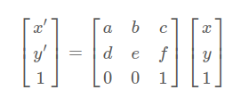
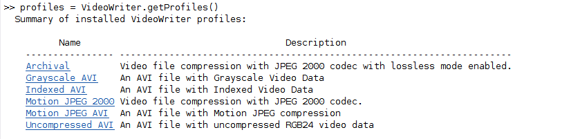

# **Image and Video Morphing**

408125029 資工三 王禮芳

## A. Image Morphing
### 1. Method description

#### 1.1 準備銜接照片

準備上一位同學影片的最後一幀，和自己的第一幀：

```matlab
v1 = VideoReader('../video/video.mp4');
v1Frame = read(v1,v1.NumFrames);
imshow(v1Frame);
```

使用 `VideoReader` 讀入影片作為一個資料結構，用 `read` 讀出影片，第二個參數可以設要第幾個 frame。對於影片資料結構而言，有個 `NumFrames` 存放影片幀數。第一個同學就以此取最後一幀，而對我們自己的影片取1。（視情況看要第幾幀，總之就是在最後一秒裡面）

*參考資料：https://www.mathworks.com/help/matlab/ref/videoreader.html*

#### 1.2 標記特徵點並建立 delaunary 三角形

這裡我們會手動標記兩張照片的特徵點，而後根據這些特徵點（再加上圖片四個頂點），算出兩張圖片的「中繼」，也就是取平均。

最後以這個平均的特徵點座標，連結彼此畫成一個個三角形（delaunary 三角形），做為之後做 affine transformation 的基礎：

```matlab
[v1_pts, my_pts] = cpselect(v1Frame, myFrame, 'Wait', true);

% append four corners, so as to cover entire image with triangles
v1_pts = [v1_pts; [1,1]; [size(v1Frame,2),1]; [size(v1Frame,2),size(v1Frame,1)]; [1,size(v1Frame,1)]];
my_pts = [my_pts; [1,1]; [size(myFrame,2),1]; [size(myFrame,2),size(myFrame,1)]; [1,size(myFrame,1)]];

% create the delaunary triangle
pts_mean = (v1_pts + my_pts) / 2;
tri = delaunay(pts_mean);
```

以下是用到的函數：

* `cpselect()` ：用來手動取點，然後把這些點的座標存下來。執行這個函數時，會進入一個 GUI 視窗進行取點。

  參數 Wait 設為 true 是為了暫時中止程式繼續往下走，程式會等 cpselect() 結束後（我們選好點後）再往下執行。

* `delaunay()` ：輸入可以是 2D 或 3D 矩陣，函數會將這些座標畫出其 delaunary triangle，回傳紀錄這些三角形的各點座標的矩陣。（每個 row 代表一個三角形，其內三個 col 就是三點座標）

*參考資料：*

*https://www.mathworks.com/help/images/ref/cpselect.html*

*https://www.mathworks.com/help/matlab/ref/delaunay.html#d124e345997*


#### 1.3 進行 morphing

先設置 morphing 的進行時間與 frame rate，這決定了我們要產生多少張照片。而後進入迴圈，每次迴圈都會產生一張轉換過程的照片。

變數 alpha 會去控制「現在轉換到哪裡了」，這是一個 0~1 間的數值，alpha 為 0 時會是我們原始待轉換的圖片（同學影片的最後一幀），為 1 時則會是轉換結果圖片（我們影片的第一幀）。

每次迴圈都會去計算基於當前 alpha 的轉換照片並儲存下來。每次迴圈都會呼叫自定義函數 `morph_triangle ` ，傳入待轉換的照片、轉換結果照片、兩張圖的特徵點、基於平均特徵點的 delaunary 三角形以及當次 alpha，計算出轉換圖片：

```matlab
duration = 2; % in seconds
frame_rate = 30;
imgNum = duration*frame_rate;

for i=1:imgNum
    % Generate each frame
    alpha = i / imgNum;
    resFrame = morph_triangle(v1Frame, myFrame, v1_pts, my_pts, tri, 0.5, alpha);

    % Output one frame as a .png file
    fileName = "image/img" + i + ".png";
    imwrite(resFrame, fileName);
end
```

##### morph_triangle

這個函數會對待轉換照片，基於當前 alpha 做 morphing：

```matlab
function morphed_im = morph_triangle(im1, im2, im1_pts, im2_pts, tri, warp_frac, alpha)
% Morph image.
inter_shape_pts = warp_frac * im2_pts + (1 - warp_frac) * im1_pts;
im1_warp = affine_warp(im1, im1_pts, inter_shape_pts, tri);
im2_warp = affine_warp(im2, im2_pts, inter_shape_pts, tri);

% And then cross-dissolved according to alpha.
morphed_im = alpha * im2_warp + (1 - alpha) * im1_warp;
end
```

我們會對兩張照片（待轉換與轉換結果）先做一次 image wrapping。而 image wrapping 的做法大意是，比對原圖的特徵點座標與「中繼圖片」的特徵點座標，使用原圖的顏色在新特徵點座標上上色，藉此產生新的轉換後的圖片——而這也就是 affine transformation。

這裡的「中繼圖片的特徵點座標」，是基於當前 wrap_frac 與 (1 - wrap_frac) 作為權重的，待轉換圖片與目標圖片的座標平均（加權平均數）。設立中繼座標點作為待轉換圖片與目標圖片 wrapping 結果的座標，是為了讓我們下一步合成兩張圖片時，特徵點都是有對上的，不然可能出現 ghost effect。我在呼叫時，把 wrap_frac 設為 0.5。

而後我們對 wrapping 的結果做「cross-dissolve」：把當前 alpha 當作權重，計算這兩個 wrapping 後的圖片每個點座標的加權平均數，作為輸出圖片。

而我們做 affine transformation 的函式也是自定義的，詳細寫法在下個小節說明。

##### affine_wrap

```matlab
function warp_im = affine_warp(im, from_pts, to_pts, tri)
```

這是我們建立 wrapped image 的函數。輸入圖片、圖片特徵點座標、目標特徵點座標與圖片的三角形座標，就會去生成基於這些輸入的轉換後圖片。

事實上，我們要做的，是把 affine transformation 用在每一個由特徵點建立的三角形：從待轉換圖片的第一個三角形開始，轉換到目標圖片的第一個三角形。這個過程會在所有圖片中的三角形轉換完後停下。

在程式中，我們先做一些前置處理：

```matlab
warp_im = im;
[h, w, channel] = size(im);
[Y, X] = meshgrid(1:h, 1:w);

%t(i) gives the index(into tri)of the first triangle containing (X(i),Y(i))
t = mytsearch(to_pts(:, 1), to_pts(:, 2), tri, X, Y); %search triangulation
tri_index_map = zeros(size(t));
valid_tri_idx = ~isnan(t); % t(i) is NaN for points not in any triangle
tri_index_map(valid_tri_idx) = t(valid_tri_idx);
```

在這裡，我們的目的是以後能夠找出每個三角形裡有哪些點（的座標），最後建立一個 tri_index_map，裡面會存放第 i 個三角形裡，有哪些座標點。

下一步，我們就要進入迴圈，每個迴圈都會去對一個三角形做 affine trandformation，迴圈結束後，圖片也就處理好了。

迴圈中，我們先找到所有在這個當前三角形中的點：

```matlab
[col, row] = find(tri_index_map == i);
```

接著進行 transformation：

affine transformation 的數學式即：



也就是 $p' = Ap$ ，我們的目標是找到 p，$p = A^{-1}p'$
```matlab
p2 = transpose([col, row, ones(size(col,1),1)]); % [x';y';1]

% computing an affine transformation matrix A between two triangles
A = computeAffine(from_pts(tri(i,:),:), to_pts(tri(i,:),:));

% Since A is 3*3 square matrix, it is invertible
p = pinv(A) * p2; % p2=Ap -> p=A^(-1)p2
p = floor(p); % index should be integer
```

轉換矩陣 A 會經由 computeAffine 得到，我們也就能由此矩陣找到 p，也就是我們建立的網格座標應有的的原始位置。

最後設定一下 p 與 p2 內元素的值，不要超過界線，就能為這些網格進行填色（對所有網格點，如果在原始圖片內，則將它們的顏色設置為原始圖像中對應位置的顏色。）：

```matlab
% warp_im(p2(1,:),p2(2,:),:)=im(p(1,:),p(2,:),:); % large memory&time!
    p_ind = sub2ind([h, w], p(2,:), p(1,:)); % convert to linear indices
    p2_ind = sub2ind([h, w], p2(2,:), p2(1,:));
    
    warp_im(p2_ind) = im(p_ind); % first channel
    if channel == 3
        warp_im(p2_ind + w*h) = im(p_ind + w*h); % second channel
        warp_im(p2_ind + 2*w*h) = im(p_ind + 2*w*h); % third channel
    end
```


#### 1.4 輸出影片

由上個部份，我們把每個 frame 都存在 image 資料夾裡，以「img + 順序」命名。這時我們將拿出這些圖片串成影片：

```matlab
video = VideoWriter('morphing'); %create the video object
video.FrameRate = 30;
open(video); %open the file for writing

for i=1:imgNum
    filename = "image/img" + i + ".png";
    I = imread(filename); %read the next image
    writeVideo(video,I); %write the image to file
end
close(video); %close the file
```

這時就會在程式執行目錄下產生名為「morphing」的影片。依照預設會產出 .avi 檔。

*參考資料：https://www.mathworks.com/help/matlab/ref/videowriter.html*

#### 1.5 其他

這整份作業都是參考 github 上的兩個專案：

1. *https://github.com/HYPJUDY/image-morphing*

   這是用 matlab 寫的，可以輸出轉變的 gif。這個專案有篇教學文章在：

   *https://hypjudy.github.io/2017/04/25/image-morphing/*

2. *https://github.com/Azmarie/Face-Morphing*

   這是 python 專案

### 2. Experimental results

實做的效果還不錯，但是沒辦法把影片附在報告上。

另外發現特徵點取越多效果越好，雖然這應該不用透過實驗證實。

### 3. Discussion

其實這個 final project 使用的函數，例如找三角形、affine transformation，基本上是直接引入別人的專案，我所做的只有除新整理需要的部份、架構主函式。

學完上課的東西，就要做出 image morphing，對我而言真的是不可能的任務。但是在 trace 別人的專案時，抽絲剝繭地發現 image morphing 演算架構與實做上更多細節，也對 affine transformation 的應用更有感。

### 4. Problem and difficulties

#### 4.1 無法使用 VideoReader

一開始連讀影片都沒辦法，後來發現好像是沒有安裝 `gstreamer1.0`。

會出現錯誤：

> Error using VideoReader/initReader Could not read file due to an unexpected error. Reason: Unable to initialize the video properties

問題討論：https://www.mathworks.com/matlabcentral/answers/497500-videoreader-error-unable-to-initialize-the-video-properties-on-debian-10

檔案連結：https://ubuntu.pkgs.org/22.04/ubuntu-main-amd64/gstreamer1.0-x_1.20.1-1_amd64.deb.html

不過目前我還是沒有花時間認識那個套件是什麽。

#### 4.2 無法輸出 .mp4 檔案

我的 matlab 無法以內建函式輸出 .mp4 檔案：



僅支援以上列表的檔案格式。這似乎是系統問題（.mp4 格式似乎不支援 linux），應該無法解決，只能自己上網轉檔。

## B. Video Morphing

### 1. Method description

#### 1. 讀入影片

```matlab
v1 = VideoReader('../../video/408410037.mp4');
myVideo = VideoReader('../../video/408125029.mp4');
```

#### 2. 每幀morphing

這部份會拿上一個同學的最後15幀 morph 自己的前15幀，以一個迭代15次的迴圈進行每一幀的 morphing。

我們在每個迴圈中，會把當前 frame 取特徵點，而後依據目前的 alpha 產生一張 morphing 後的圖片。迴圈結束後，我們就有了15幀從前一位同學到我的中繼漸變照片。

```matlab
imgNum = 15;
for i = 1:imgNum
    alpha = i / imgNum;
    
    % 2.1 Obtain each frame from the two video
    v1Frame = read(v1,v1.NumFrames - i + 1);
    myFrame = read(myVideo,i);
    
    % 2.2 Select the key points from two frames
    [v1_pts, my_pts] = cpselect(v1Frame, myFrame, 'Wait', true);
    v1_pts = [v1_pts; [1,1]; [size(v1Frame,2),1]; [size(v1Frame,2),size(v1Frame,1)]; [1,size(v1Frame,1)]];
    my_pts = [my_pts; [1,1]; [size(myFrame,2),1]; [size(myFrame,2),size(myFrame,1)]; [1,size(myFrame,1)]];
    
    % 2.3 create the delaunary triangle
    pts_mean = (v1_pts + my_pts) / 2;
    tri = delaunay(pts_mean);

    % 2.4 Generate each frame
    resFrame = morph_triangle(v1Frame, myFrame, v1_pts, my_pts, tri, alpha, alpha);

    % 2.5 Output one frame as a .png file
    fileName = "../image/img" + i + ".png";
    imwrite(resFrame, fileName);
end
```

#### 3. 輸出影片

我用 matlab 串接，先把前一位同學從頭到最後倒數15幀的地方用 videoWriter 寫入目標輸出影片，而後把那15幀加進去，最後串接上我的影片（從第16幀開始）：

```matlab
video = VideoWriter('../morphing_v2.avi'); %create the video object
video.FrameRate = 30;
open(video); %open the file for writing

% The original video deleted the last 15 frames
for i = 1:v1.NumFrames - imgNum
    videoFrame = read(v1,i);  
    writeVideo(video,videoFrame);
end

% The morphing video (15 frames)
for i = 1:imgNum
    filename = "../image/img" + i + ".png";
    I = imread(filename); %read the next image
    writeVideo(video,I); %write the image to file
end

% My video deleted the first 15 frames
for i = 6:myVideo.NumFrames
    videoFrame = read(myVideo, i);  
    writeVideo(video,videoFrame);
end

close(video); %close the file
```

### 2. Experimental results

結果的影片與照片在雲端：https://drive.google.com/drive/folders/17vvrdpzjgilmcyiyn85JpKrn9-Om4D0N?usp=sharing

影片檔名是 `morphing_v2.avi`（我的matlab無法直接輸出 mp4），morphing 大約在2:42~2:43的地方。

我自己覺得臉的效果還可以，但身體真的差強人意，我們的身體部份差異頗多（我是低領，同學領子小滿多、同學肩膀上有馬尾而我沒有），致使特徵點很找，而結果就不太好。

### 3. Discussion

這時才突然發現 video morphing 和 image morphing 串接成影片的差異，原本 final project 的作法會讓串接後的影片長度大於兩者相加，因為中間多了 morphing 過去的地方，但 video morphing 感覺就像是影片一邊進行，而 morphing 也在持續發揮作用，和我在 final project 的作法相比，video morphing 確實更為理想（但做出來的效果是另外一回事qq）。

### 4. Problem and difficulties

#### 找特徵點

我原來的 final project 的實做方式是手動找特徵點，但這在 video morphing 較麻煩了：如果我們每張照片找100個左右的特徵點，而總共要  morphing 15 幀，那就要手動點一千多個點，而且有時出來的效果不太好，還要重新找一次。

這次的 final project 我來來回回，反覆修改感覺怪怪的某幾幀，做完手好像要壞掉了。

這也讓我徹底體會自動標記特徵點的重要性。
